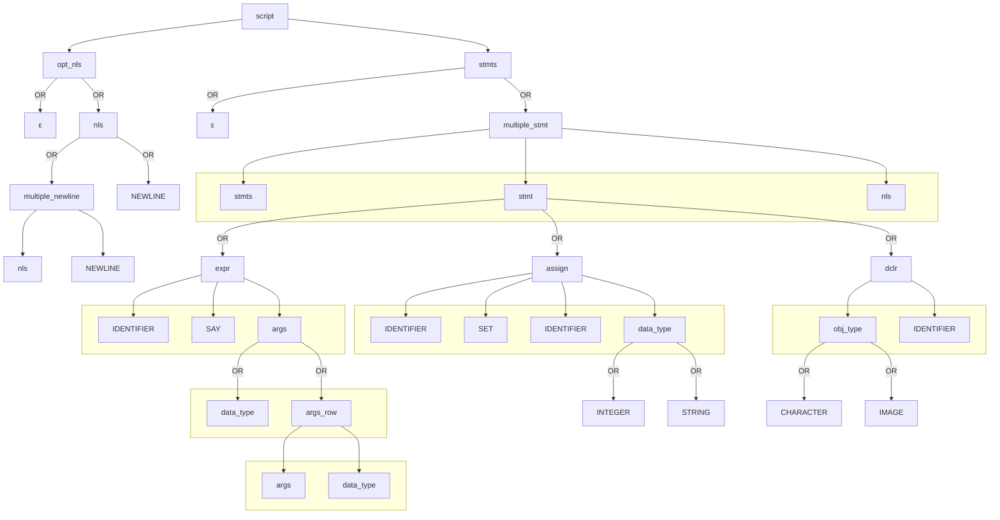

```mermaid
flowchart TD
    S["script"]
    
    S --> opt_nls
    S --> stmts
    
    opt_nls -->|OR| E2["ε"]
    opt_nls -->|OR| nls
    
    nls -->|OR| NEWLINE
    nls -->|OR| N1["multiple_newline"]
    
    N1 --> N2["nls"]
    N1 --> N3["NEWLINE"]
    
    stmts -->|OR| E1["ε"]
    stmts -->|OR| multiple_stmt
    
    multiple_stmt --> stmts1["stmts"]
    multiple_stmt --> stmt
    multiple_stmt --> N4["nls"]
    
    subgraph stmt_stmts_group[" "]
        stmts1
        stmt
        N4
    end
    
    stmt -->|OR| dclr
    stmt -->|OR| assign
    stmt -->|OR| expr

    dclr --> obj_type
    dclr --> IDENTIFIER
    
    subgraph dclr_stmt_group[" "]
        obj_type
        IDENTIFIER
    end

    obj_type -->|OR| CHARACTER
    obj_type -->|OR| IMAGE
    
    subgraph obj_type_group[" "]
        CHARACTER
        IMAGE
    end
    style obj_type_group fill:transparent,stroke:transparent

    assign --> ID0["IDENTIFIER"]
    assign --> SET0["SET"]
    assign --> ID1["IDENTIFIER"]
    assign --> data_type
    
    subgraph assign_stmt_group[" "]
        ID0
        SET0
        ID1
        data_type
    end
    
    data_type -->|OR| INTEGER
    data_type -->|OR| STRING
    
    subgraph data_type_group[" "]
        INTEGER
        STRING
    end
    style data_type_group fill:transparent,stroke:transparent
    
    expr --> ID2["IDENTIFIER"]
    expr --> SAY0["SAY"]
    expr --> args
    
    subgraph expr_stmt_group[" "]
        ID2
        SAY0
        args
    end
    
    args -->|OR| data_type_1["data_type"]
    args -->|OR| args_row
    
    subgraph args_group[" "]
        data_type_1
        args_row
    end
    
    args_row --> args_l["args"]
    args_row --> args_r["data_type"]
    
    subgraph args_row_group[" "]
        args_l
        args_r
    end
```
